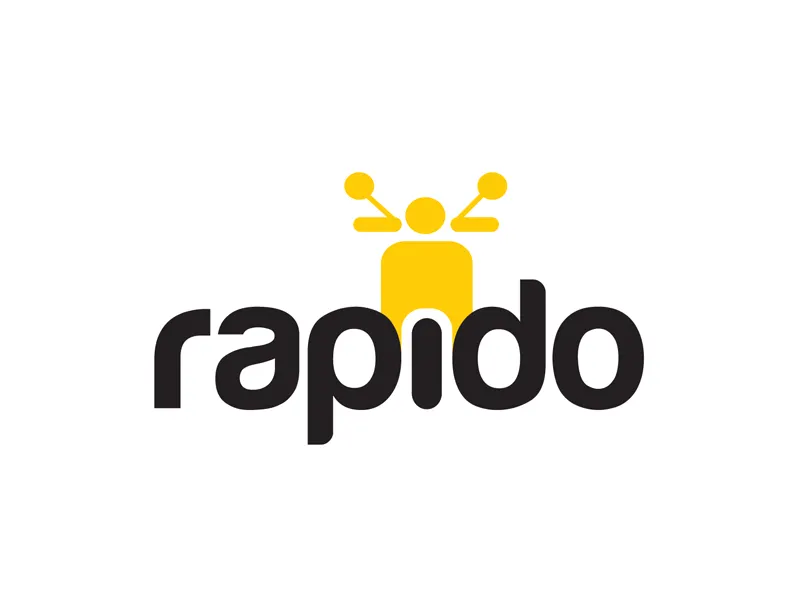
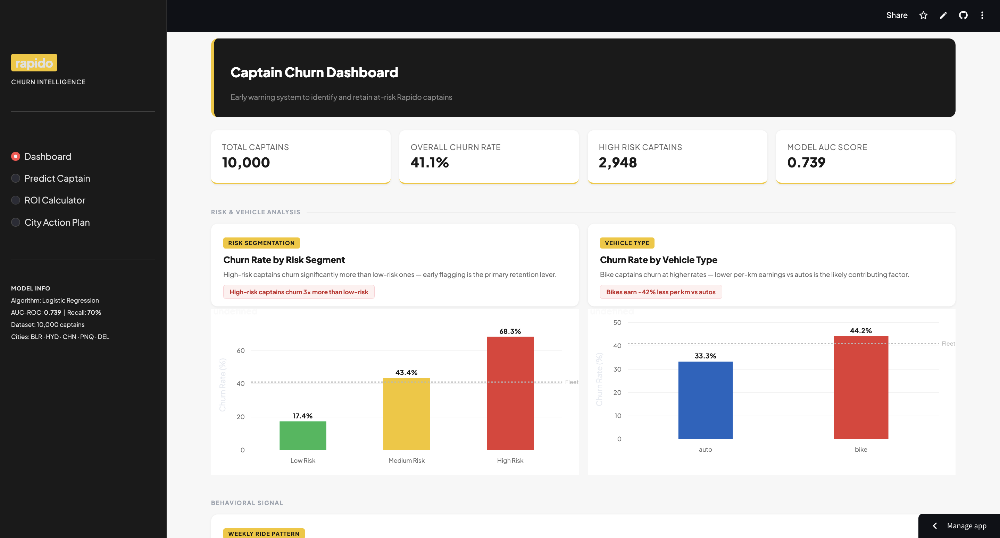
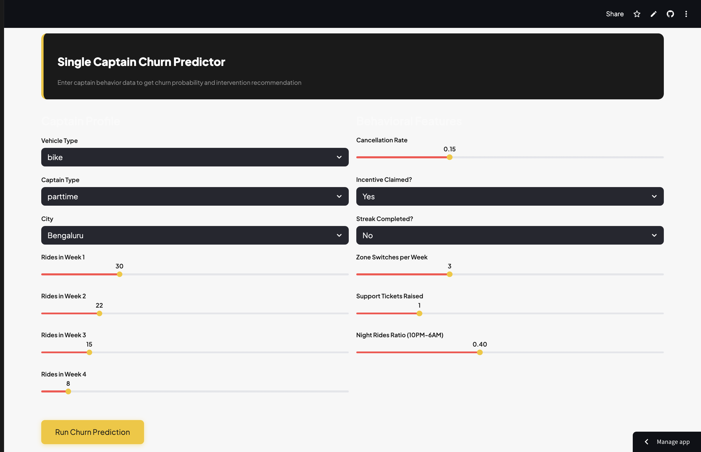
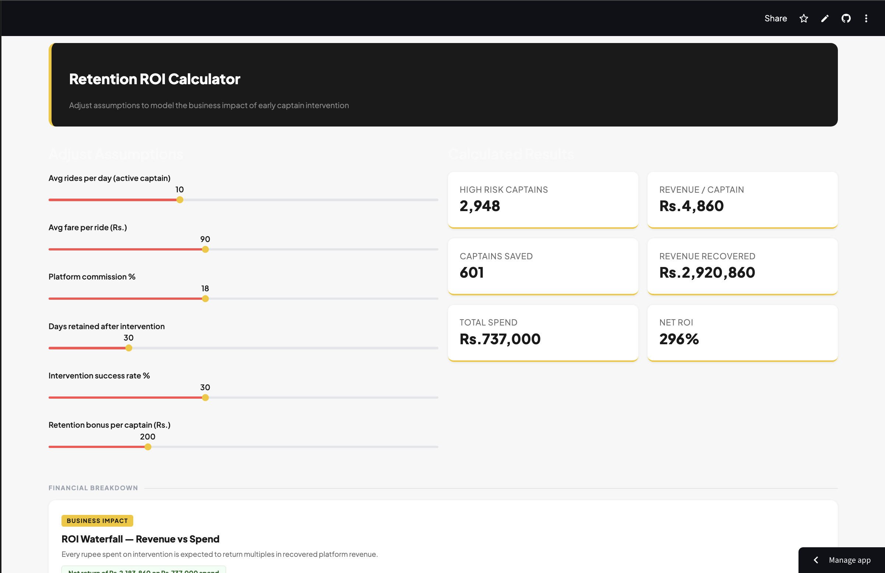
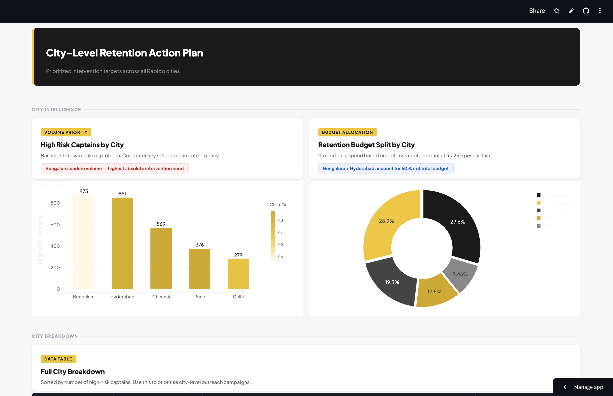

<div align="center">



# Rapido Captain Churn Predictor

### An end-to-end ML system to identify and retain at-risk bike taxi captains before they go inactive

<br>


<br>

> **"I built an unsolicited churn model for Rapido captains using public research data. Here's what I found."**

[ Live Demo](https://rapido-captain-retention-v68hsrmnzd52p3app4we6xl.streamlit.app) · [ Notebooks](#-project-structure) · [ Results](#-key-eda-findings) · [ ROI](#-business-impact)

</div>

---

## App Preview

### Dashboard

> *Real-time KPIs, ride decay curve, and top 20 highest risk captains*

### Single Captain Predictor

> *Enter captain behavior → get churn probability with gauge chart + intervention recommendation*

### ROI Calculator

> *Interactive sliders to model retention economics with waterfall chart*

### City Action Plan

> *City-wise risk breakdown with budget allocation and priority ranking*

---

## Problem Statement

Rapido, India's largest bike taxi platform, faces a critical supply-side challenge — **40% of newly onboarded captains go inactive within 4 weeks** of joining.

Every lost captain costs the platform approximately **Rs. 5,360** in lost revenue and replacement acquisition costs.

This project builds an **early warning system** that:
- Predicts which captains are likely to churn **before** they do
- Segments all captains into Low / Medium / High risk buckets
- Recommends specific, cost-effective interventions per segment
- Quantifies the **ROI of acting early** vs. doing nothing

---

## Why Not the Kaggle Dataset?

The only public Rapido dataset on Kaggle (`vengateshvengat/rapido-all-data`) was verified to be **low-quality synthetic data**:

| Metric | Their Data | Reality |
|---|---|---|
| Cancellation rate | ~10% across ALL service types | Should vary: bike ~15%, auto ~8% |
| Fare per km | Rs.43 across ALL service types | Should vary: bike Rs.11, auto Rs.19 |
| Avg duration | 64 mins across ALL service types | Should vary: 15–45 mins |
| Payment split | Exactly 25% each | Impossible in real life |

Instead, I built a **research-grounded simulation** from scratch. Every parameter is documented with a source in [`data_assumptions.md`](data_assumptions.md).

---

## Project Structure

```
rapido-captain-churn/

 notebooks/
 01_data_creation.ipynb ← Synthetic data simulation
 02_eda.ipynb ← Exploratory data analysis (7 charts)
 03_modeling.ipynb ← ML training, SHAP, risk scoring
 04_business.ipynb ← ROI calculator & executive summary

 data/
 captains_synthetic.csv ← 10,000 captain simulation
 captains_scored.csv ← With churn probabilities + segments

 models/
 churn_model_final.pkl ← Trained Logistic Regression

 app/
 streamlit_app.py ← 4-page interactive dashboard

 assets/ ← Screenshots for README
 dashboard.png
 predict.png
 roi.png
 city.png

 data_assumptions.md ← Every parameter sourced & justified
 requirements.txt
 README.md
```

---

## Dataset

10,000 captain simulation grounded in real research:

| Feature | Description | Value | Source |
|---|---|---|---|
| `captain_type` | Fulltime vs parttime | 40% / 60% | Reddit: most treat as side hustle |
| `rides_week1–4` | Weekly ride counts | FT: ~80/wk, PT: ~28/wk | Reddit: 10–15 rides/day |
| `cancellation_rate` | By vehicle type | Bike: 8–22%, Auto: 4–14% | Industry reports |
| `avg_fare_per_km` | Earnings per km | Bike: Rs.11, Auto: Rs.19 | Reddit captain vlogs |
| `night_rides_ratio` | Rides after 10PM | Higher for parttime | Reddit: 20% night bonus |
| `streak_completed` | 7-day streak done | 27% completion | Reddit: "8 rides in 4hrs is hard" |
| `is_churned` | Inactive 30+ days | **41.06% churn rate** | Target variable |

---

## Key EDA Findings

<table>
<tr>
<td width="50%">

**1. Ride Decay is the #1 Signal**

Churned captains crash from 37 → 10 rides by Week 4 (73% drop). Active captains hold at 57 → 19. Gap is detectable by **Week 2**.

</td>
<td width="50%">

**2. Bike Captains Churn 1.5x More**

Bike: **44%** vs Auto: **33%** — consistent across every city. Lower fare per km (Rs.11 vs Rs.19) = thinner margins = faster dropout.

</td>
</tr>
<tr>
<td>

**3. ⏰ Parttime = Flight Risk**

Parttime churn: **56%** vs Fulltime: **19%**. Low switching cost and side hustle mindset. They quit without hesitation.

</td>
<td>

**4. Earnings Drive Retention**

Daily earnings correlation with churn: **r = -0.36**
Cancellation rate: only **r = 0.11**
Fix earnings first, not cancellations.

</td>
</tr>
</table>

---

## ML Modeling

### Model Comparison

| Model | ROC-AUC | Precision | Recall | F1 |
|---|---|---|---|---|
| **Logistic Regression** | **0.739** | **0.589** | **0.701** | **0.640** |
| Random Forest | 0.740 | 0.608 | 0.663 | 0.634 |
| XGBoost | 0.733 | 0.594 | 0.663 | 0.626 |

**Final model: Logistic Regression** — best AUC, most explainable, fastest inference.

> Linear model winning over tree-based models makes sense — ride volume drop affects churn monotonically. AUC 0.739 is production-acceptable (industry standard: 0.72–0.78).

### Pipeline
```
Raw Features (24)
 → SMOTE (balance classes)
 → Time-based train/test split (80/20)
 → Logistic Regression
 → SHAP Explainability
 → Risk Segmentation (Low / Medium / High)
```

### SHAP Feature Importance

```
Rank Feature SHAP Value Direction

 1 rides_week4 0.52 Low rides → churn ↑
 2 estimated_daily_earnings 0.28 Low earnings → churn ↑
 3 cancellation_rate 0.23 High cancel → churn ↑
 4 incentive_claimed 0.20 Claimed → churn ↓
 5 streak_completed 0.13 Completed → churn ↓
 6 rides_week3 0.11 Low rides → churn ↑
 7 zone_switches 0.10 High switch → churn ↑
 8 petrol_cost_sensitivity 0.10 High sensitivity → churn ↑
```

### Risk Segmentation Validation

| Segment | Captains | Actual Churn |
|---|---|---|
| Low Risk (prob < 0.35) | 3,729 | **17%** |
| Medium Risk (0.35–0.65) | 3,323 | **43%** |
| High Risk (prob > 0.65) | 2,948 | **68%** |

---

## Business Impact

### Retention ROI (Base Assumptions)

```

 RAPIDO RETENTION ROI SUMMARY 

 High Risk captains identified → 2,948 
 Estimated actual churners → 2,004 
 Captains saved (30% success) → 601 

 Revenue per saved captain (30d) → Rs. 4,860 
 Total revenue recovered → Rs. 29.2L 

 Total intervention spend → Rs. 7.4L 
 NET ROI → 296% 

```

### Cost of Doing Nothing

| | Without Intervention |
|---|---|
| Captains lost | 2,004 |
| Revenue lost (30 days) | Rs. 97.4 lakh |
| Replacement cost | Rs. 10 lakh |
| **Total loss** | **Rs. 1.07 crore** |

> Intervention spend of Rs. 7.4 lakh saves Rs. 1 crore in losses.

### Intervention Strategy by Segment

| Segment | Captains | Action | Urgency |
|---|---|---|---|
| High Risk | 2,948 | Rs.200 bonus + personal call | Within 48 hrs |
| Medium Risk | 3,323 | Push notification + streak offer | Within 1 week |
| Low Risk | 3,729 | Standard engagement | Routine |

### City Action Plan

| City | High Risk Captains | Avg Churn % | Budget Needed |
|---|---|---|---|
| Bengaluru | 873 | 44.7% | Rs. 2.18L |
| Hyderabad | 851 | 48.5% | Rs. 2.13L |
| Chennai | 569 | 48.8% | Rs. 1.42L |
| Pune | 376 | 48.8% | Rs. 0.94L |
| Delhi | 279 | 47.1% | Rs. 0.70L |

**Strategy:** Prioritize Bengaluru for volume, Hyderabad/Chennai for rate reduction.

---

## Tech Stack

| Layer | Tool | Purpose |
|---|---|---|
| Language | Python 3.10 | Core |
| Data Simulation | NumPy, Pandas | Build synthetic dataset |
| SQL Analytics | DuckDB | Fast aggregation queries |
| Imbalance Handling | imbalanced-learn SMOTE | Handle class imbalance |
| ML Models | Scikit-learn, XGBoost | Train churn classifiers |
| Explainability | SHAP | Feature importance |
| Visualization | Plotly, Seaborn, Matplotlib | Charts & EDA |
| Dashboard | Streamlit | Interactive app |
| Persistence | Joblib | Save/load model |
| Notebooks | Google Colab | Development |
| Version Control | Git + GitHub | Code management |

---

## Run Locally

```bash
# Clone repo
git clone https://github.com/YOURUSERNAME/rapido-captain-churn
cd rapido-captain-churn

# Install dependencies
pip install -r requirements.txt

# Launch app
streamlit run streamlit_app.py
```

App opens at `http://localhost:8501`

---

## requirements.txt

```
streamlit==1.57.0
pandas
numpy
scikit-learn
xgboost
imbalanced-learn
shap
plotly
joblib
duckdb
seaborn
matplotlib
```

---

## Limitations

Being transparent about what this project does not capture:

- No seasonal effects (Diwali spikes, IPL surge, monsoon impact)
- No geographic micro-zone data (lane-level demand patterns)
- No actual Rapido incentive structure (proprietary)
- No competitor switching behavior (Ola, Uber, Namma Yatri)
- Churn label is simulated, not from real platform logs
- All models cluster at AUC ~0.74 — linear data generation creates a ceiling

---

## Data Assumptions

See [`data_assumptions.md`](data_assumptions.md) for every parameter with source.

**Primary sources:**
- Reddit r/bangalore, r/hyderabad, r/chennai — captain posts (2024)
- Rapido captain YouTube vlogs
- NPCI UPI market share dashboard (2024)
- MoRTH Road Transport Yearbook (2023)
- Rapido press releases on captain onboarding
